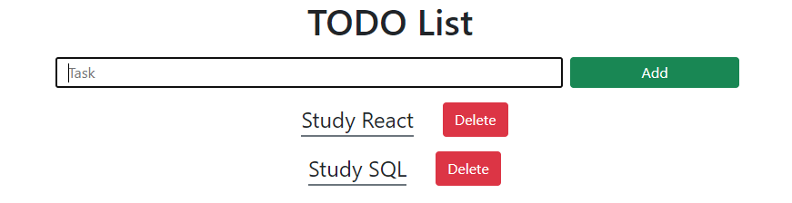

  

------------

# TODO List

## React exercises

##### Made by Rodrigo Carvalho

------------

### Project:
 
It's a simple TODO List application made with React. You can add a task by clicking the "Add" green button or by pressing Enter and to delete a task you have to click the "Delete" red button next to this task.

  

------------

### How to run the code?:
1. Install the npm packages: `$ npm install`;
1. Build the application: `$ npm run start`.

------------

Exercises made during the **Full Stack Developer Coding Bootcamp** at **4Geeks Academy**